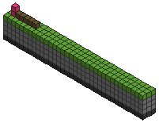

# MineRL



[MineRL](https://github.com/minerllabs/minerl) (Guss et al., IJCAI 2019) is a
dataset of 500+ hours of human Minecraft play paired with RL environments built
on Malmo. This is a program synthesis rendering of those environments: 17
problems covering all six MineRL task families except `Survival`, which by
design has no reward function.

## What is modelled

The real environments give an agent a 64x64 RGB frame and take keyboard and
mouse actions through a live Minecraft server. None of that is reachable from
Julia, and none of it is what makes MineRL interesting.

What is interesting is the **item hierarchy** (paper, Fig. 2): logs become
planks become sticks become pickaxes, and each tier of pickaxe unlocks the next
tier of ore. That is modelled exactly, on a discrete voxel world with a gridded
agent. Stone needs a wooden pickaxe, iron ore a stone one, diamond an iron one,
so `obtain_diamond` really does require the whole ladder.

Three things are deliberately different. Worlds are smaller (a Navigate goal is
8 to 12 blocks away, not 64; Treechop asks for 8 logs, not 64) because a
synthesiser enumerates a plan rather than learning it. Tools are auto-equipped,
as in MineRL's simplified action space, so no action is spent equipping. And
animals are one-off blocks, so "hunting" one is mining it.

## Grammars

Two, and the smaller is a strict *rule-index* prefix of the larger, so rule `k`
means the same thing in both and one interpreter serves them.

`grammar_minerl_navigate` (29 rules) is movement, control flow and the compass
conditions. The `Navigate` problems use it: their difficulty is terrain.

```
Start     = run_minerl(Sequence, _arg_1)
Sequence  = Operation | seq(Operation, Sequence)
Operation = move_forward | move_back | strafe_left | strafe_right
          | turn_left | turn_right | jump_forward
          | repeat_op(Count, Sequence)
          | if_op(Condition, Sequence, Sequence)
          | while_op(Condition, Sequence)
Condition = at_goal | goal_ahead | goal_behind | goal_left | goal_right
          | blocked_ahead | can_step_up | not_op(Condition)
Count     = 1..8
```

`grammar_minerl` (84 rules, the module default) adds everything the `Obtain*`
tasks need:

```
Operation = mine_forward | mine_forward_up | mine_down | mine_up
          | place_forward(Placeable) | craft(Craftable) | smelt(Smeltable)
Condition = block_ahead_is(Block) | block_below_is(Block)
          | has_at_least(Item, Count)
```

`Operation` derives *function values* composed by `seq`, the same shape
DreamCoder's tower grammar uses, so `repeat_op` and `while_op` take a body to
run without the grammar binding a variable.

## Running it

```julia
using HerbBenchmarks, HerbBenchmarks.MineRL_2019
const M = MineRL_2019

problem = get_problem(M, "obtain_diamond")
grammar = get_grammar(M, "obtain_diamond")     # grammar_minerl

program = M.reference_program("obtain_diamond")
M.interpret(program, problem.spec[1])          # true
```

Each problem holds one `IOExample` whose output is `true`, which is MineRL's
own task definition: a sparse `+1` for reaching the goal or obtaining the item.

Sparse reward is a poor search signal, so three other views exist:

```julia
world = problem.spec[1].in[:_arg_1]
body  = M.program_function(program)

M.evaluate_trace(body, world)   # (observation, is_done, reward), the triple
                                # HerbSearch's trace-guided iterators consume
M.trace_problem("obtain_diamond")    # Problem{Vector{Trace}}, every intermediate world
M.metric_problem("obtain_diamond")   # MetricProblem with a dense cost
```

The reward is shaped along the item hierarchy, not the final inventory: the
final inventory is not even monotone, since crafting an iron pickaxe consumes
the ingots, so an agent that got further would score lower. `MineWorld` records
every item ever held (MineRL annotates its own trajectories with
item-collection events for the same reason) and `progress` scores against
`prerequisites(target)`, which is recovered from the recipe tables:

```
nothing yet 0.000   logs 0.077   wooden 0.385   stone 0.538   iron 0.846   diamond 1.000
```

## Visualising

```julia
M.visualize(program, problem; path="run.gif")   # one frame per action
M.visualize(program, problem; path="run.svg")   # the final world
M.print_world(world)                            # side-on ASCII slice
```

Frames come from re-running the program under a tightened action budget, so the
world model carries no tracing machinery. The agent is magenta, the Navigate
goal yellow. Rendering is the dependency-free `src/utils/voxel_render.jl`.

## Relation to HerbSearch

`HerbSearch/src/minecraft` drives the real `minerl` gym environments through
PyCall and searches with `probe`. It needs a JDK, a Minecraft install and the
Python package. This benchmark is the self-contained counterpart: same task
family, same `(observation, is_done, reward)` interface, no simulator.

## Citation

> Guss, William H., Brandon Houghton, Nicholay Topin, Phillip Wang, Cayden
> Codel, Manuela Veloso, and Ruslan Salakhutdinov. "MineRL: A Large-Scale
> Dataset of Minecraft Demonstrations." *IJCAI*, 2019, pp. 2442-2448.

See `citation.bib`, which also cites Malmo.
